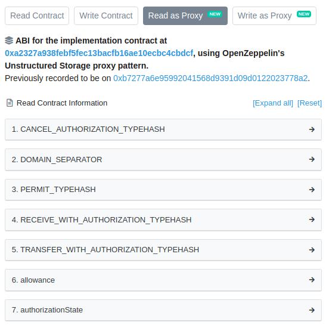

# 以太坊改进提案(EIPs)

## (EIP-1967:标准代理存储插槽)[https://eips.ethereum.org/EIPS/eip-1967!]

### 概要

标准化代理层存储与委托逻辑合约地址映射，以及其它特定代理层信息

### 目录

- <a hef='#001'>摘要</a>
- 动机
- 规范
  - 逻辑合约地址
  - 信标合约地址
  - 管理员地址
- 基本原理
- 参考实现
- 注意事项
- 版权

<h3 id="001">
摘要
</h3>

委托代理合约广泛用于升级和节约gas。这些代理层依赖逻辑合约（也称作实现合约或者主备），逻辑合约通过delegatecall调用。这允许代理在将代码委托给逻辑契约时保持持久状态（存储和平衡）。

为避免逻辑合约和代理合约在存储应用中出行碰撞，逻辑合约地址通常保存在特定存储槽中(例如OpenZeppelin合约中0x360894a13ba1a3210667c828492db98dca3e2076cc3735a920a3ca505d382bbc)保证编译器永远不会分配。EIP提出了一套标准的插槽来存储代理信息。这允许像块探索器这样的客户端正确地提取这些信息并显示给最终用户，并且逻辑合约选择地对其进行操作。

<h3 id="001">
动机
</h3>

委托代理被广泛使用，作为支持升级和降低部署的gas成本的一种手段。
这些代理的例子可以在OpenZeppelin Contracts, Gnosis, AragonOS, Melonport, Limechain, WindingTree, Decentraland和许多其他合同中找到。
但是，由于缺乏用于获取代理的逻辑地址的通用接口，因此不可能构建基于此信息的通用工具。
一个典型的例子是块资源管理器。在这里，最终用户希望与底层逻辑契约进行交互，而不是与代理本身进行交互。
使用从代理检索逻辑合同地址的通用方法，允许块资源管理器显示逻辑合同的ABI，而不是代理的ABI。
浏览器检查契约在区分槽处的存储，以确定它是否确实是代理，在这种情况下，它同时显示代理和逻辑契约的信息。
例如，在以太扫描上显示0xa0b86991c6218b36c1d19d4a2e9eb0ce3606eb48的方式：

另一个例子是逻辑合约，它们明确地作用于它们被代理的事实。这允许它们可能地触发代码更新，作为其逻辑的一部分。
一个公共存储插槽允许这些用例独立于所使用的特定代理实现。

<h3 id="001">
规范
</h3>

代理监控对于许多应用程序的安全性至关重要。因此，必须能够跟踪对实施和管理槽的更改。不幸的是，跟踪存储槽的变化并不容易。
因此，建议任何改变这些槽的函数也应该发出相应的事件。这包括初始化，从0x0到第一个非零值。
代理特定信息的建议存储槽如下。可以根据需要在后续 ERC 中添加更多用于附加信息的插槽。

<h4>
逻辑合约地址
</h4>

<h4>
信标合约地址
</h4>

<h4>
管理员地址
</h4>

<h3 id="001">
基本原理
</h3>

<h3 id="001">
参考实现
</h3>

<h3 id="001">
注意事项
</h3>

<h3 id="001">
版权
</h3>

